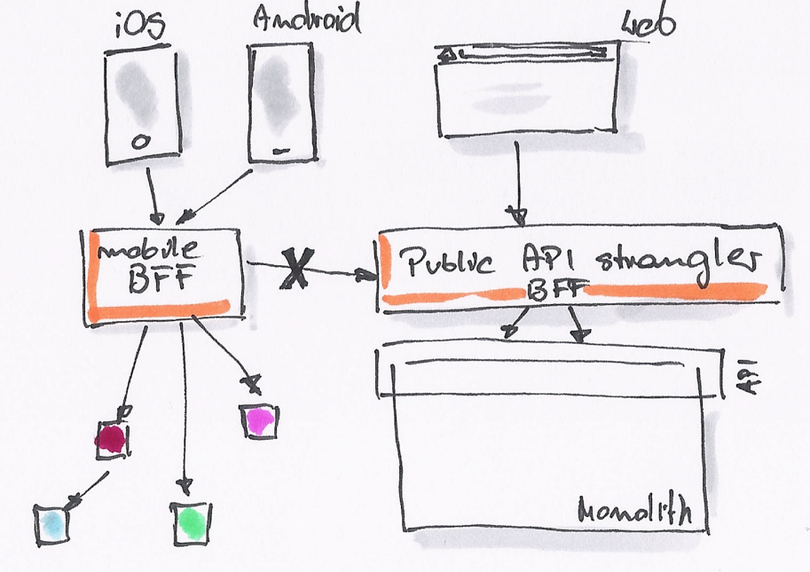
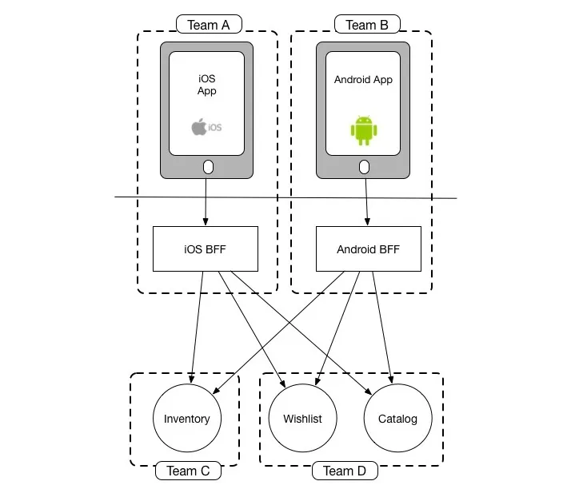
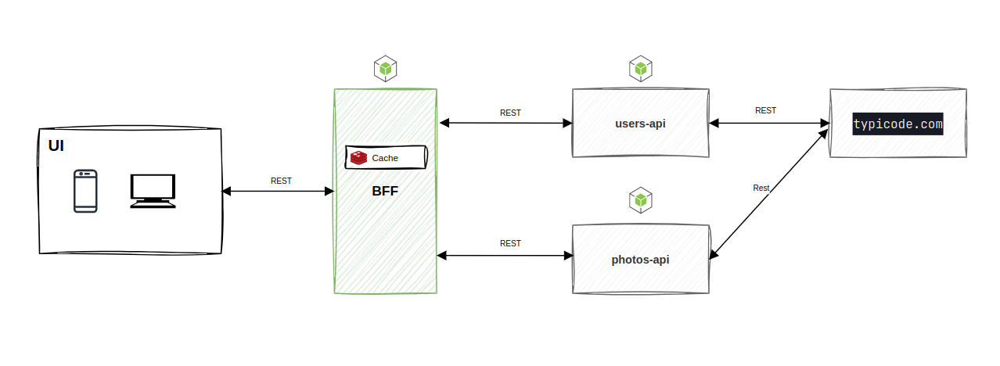

# BFF

[](https://github.com/venzel/bff/blob/master/LICENSE)

> API com padrão arquitetural BFF e microserviços com Clean Architecture.

## Papel do BFF

<p align="center">
    
</>

o BFF atua como uma interface simples entre o frontend e os microsserviços.

### Vantagens

-   Separação das responsabildiades;
-   Fácil manutenção;
-   Melhor tratamento de erros no frontend;
-   Vários tipos de dispositivos podem chamar o back-end em paralelo;
-   Melhora a segurança;
-   Propriedade compartilhada de componentes pela equipe.

<p align="center">
    
</>

### Desvantagens

-   Aumenta a latência;

BFF é semelhante a um servidor proxy entre o cliente e outras APIs externas, serviços, etc. Se a solicitação tiver que passar por outro componente, com certeza aumentará a latência. No entanto, a latência do BFF é insignificante em comparação com o alto uso de recursos do navegador se ele precisar trabalhar com vários serviços não otimizados para o frontend.

## Stack

-   NodeJs/Express;
-   Typescript;
-   Docker (MongoDB, Redis);
-   Jest;

## Padrão de projeto

<p align="center">
    
</>

## Árvore do BFF

```bash
src
├── app.ts
├── framework
│   └── integrations
├── infra
│   ├── datasource
│   ├── httpclients
│   └── loggers
├── main
│   ├── adapters
│   ├── configs
│   ├── containers
│   ├── errors
│   ├── helpers
│   ├── index.ts
│   ├── mappers
│   ├── middlewares
│   └── routes
├── presentation
│   ├── contracts
│   ├── controllers
│   └── helpers
└── usecases
    ├── contracts
    ├── helpers
    └── user.usecase.ts
```

## Referências

👉 [O padrão BFF (Backend para Frontend): uma introdução](https://blog.bitsrc.io/bff-pattern-backend-for-frontend-an-introduction-e4fa965128bf)<br />
👉 [BFF SoundCloud](https://www.thoughtworks.com/insights/blog/bff-soundcloud)

<div>
  
  <sub>Made with 💙 by <a href="https://github.com/venzel">Enéas Almeida</a></sub>
</div>
